# DuoMech

> 탑다운 협력 멀티플레이 퍼즐 게임  
> Unreal Engine 5 | C++ | Blueprint | LAN Networking | UMG

---

## 프로젝트 개요

**DuoMech**는 두 명의 플레이어가 각기 다른 방향으로만 움직일 수 있는 특성을 갖고 협력하여 퍼즐과 함정을 돌파하는 탑다운 퍼즐 게임입니다.
Player1은 앞/뒤로만, Player2는 좌/우로만 움직일 수 있어 **협력 없이는 절대로 진행이 불가능**합니다.
LAN 기반 멀티플레이 환경에서 친구와 함께 플레이할 수 있습니다.

---

## 주요 기능

### 제한된 조작 기반 협력 시스템

- **Player1**: 앞/뒤 이동만 가능
- **Player2**: 좌/우 이동만 가능
- 개별 이동만으로는 진행 불가 → **협력하여 퍼즐을 해결해야만 진행 가능**
- 레벨 디자인과 함정/트랩 요소 모두 이 구조를 전제로 구성됨

### 플레이어 시스템

- 역할(Role) 기반으로 **HUD, 리스폰 위치, 이동 방식, 트랩 회피 방식** 차별화
- `EPlayerRole` 열거형으로 분기 처리, GameState와 Controller에서 역할 관리

### LAN 멀티플레이
- 언리얼 세션 생성/참가 기능 구현
- Server RPC/Multicast를 통한 서버/클라이언트 간 상태 동기화

### 레이저 장애물 (DMLaserZone)

* 플레이어가 스스로의 조작으론 피할 수 없도록 설계 -> **게임 플레이 간 긴장감 유지**

- **플레이어 위치 기반** 레이저 생성 (8초 간격)
- Player1은 **좌우 회피** / Player2는 **앞뒤 회피**
- 시작 트리거 진입 시 **자동 활성화**, 완료 트리거 진입 시 **자동 비활성화**

### 적 AI 캐릭터 (DMCharacterExploder)

- ENUM 기반 상태 정의 (Patrol, Detected, Chasing, Exploding, Dead)
- 특정 조건(플레이어 캐릭터 감지 3초 후)에서 **폭발 애니메이션 및 효과 발생**
- 폭발 시 주변 플레이어 캐릭터에 영향(플레이어 캐릭터 사망) 가능
- **`Multicast`**로 폭발 효과를 모든 클라이언트에 동기화
- 폭발 후 플레이어 캐릭터 사망 시 자동 리스폰 및 상태 초기화 처리 → `DMStageManager` 연동

### 퍼즐 오브젝트 시스템

- 열쇠 상자(Box)와 문(Door) 연동
- 상자 오버랩 → 열쇠 획득 → 문 열림
- 상태는 서버에서 제어하고 **`Multicast`**로 전파

### 스테이지 관리 (DMStageManager)
- 스테이지별 시작/완료 트리거로 상태 관리
- 시작 트리거 진입: 죽을 수 있는 상태 + 레이저 활성화 - 스테이지 시작
- 완료 트리거 진입: 무적 상태 + 레이저 비활성화 - 스테이지 전환
- 리스폰 위치, 초기화 시점, 상태 복원 등 모두 DMStageManager에서 제어

### HUD 시스템
- Player1/Player2 각자 전용 UMG HUD (`WBP_DMPlayer1HUD`, `WBP_DMPlayer2HUD`)
- 방향키(WASD) 입력 시 HUD 이미지 색상 실시간 변경

---

## 기술 스택

| 분류            | 기술                                 |
| --------------- | ------------------------------------ |
| Engine          | Unreal Engine 5.3                    |
| Language        | C++                                  |
| Networking      | Unreal RPC, Replication, LAN Session |
| UI              | UMG (Blueprint + C++)                |
| Input           | Enhanced Input System                |
| FX              | Niagara, Sound Cue                   |
| Version Control | Git / GitHub                         |

---

## 문제 해결 사례

| 문제                                          | 해결 방법                                                    |
| --------------------------------------------- | ------------------------------------------------------------ |
| 클라이언트에서만 문이 열리는 현상             | 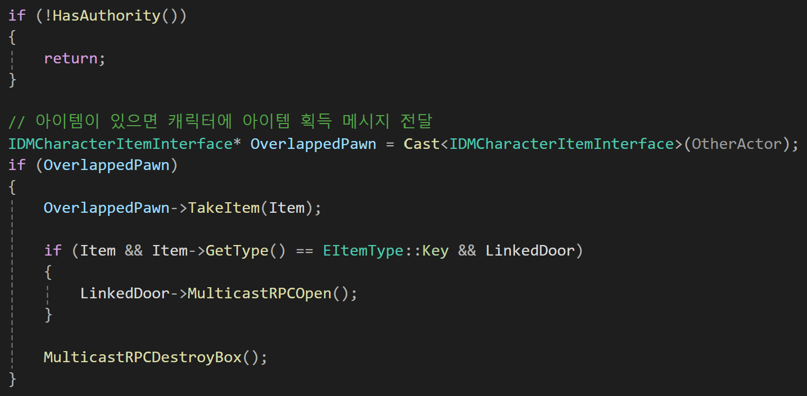 상태 변경을 서버에서 처리 + `Multicast` 함수로 모든 클라이언트에 전달 |
| 키 입력이 없을 때 HUD 키 색상이 변경되지 않음 | 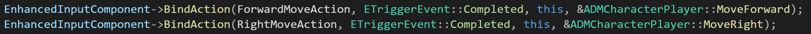 `EnhancedInput` 이벤트 바인딩에 `Complete` 트리거를 추가해 해결 |
| 플레이어 리스폰 위치가 동일함                 | 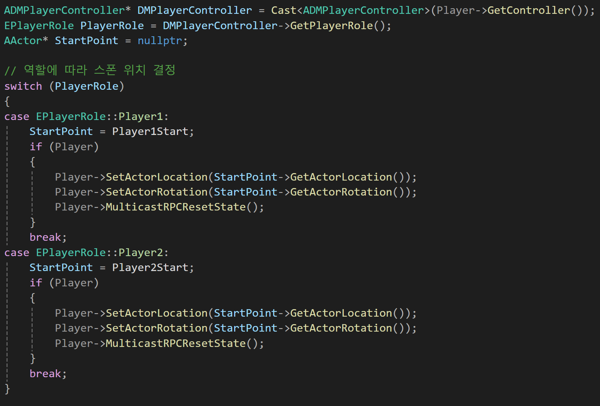 `EPlayerRole` 기준으로 `DMStageManager`에서 위치 분기 |
| 레이저 타이밍 동기화 문제                     | 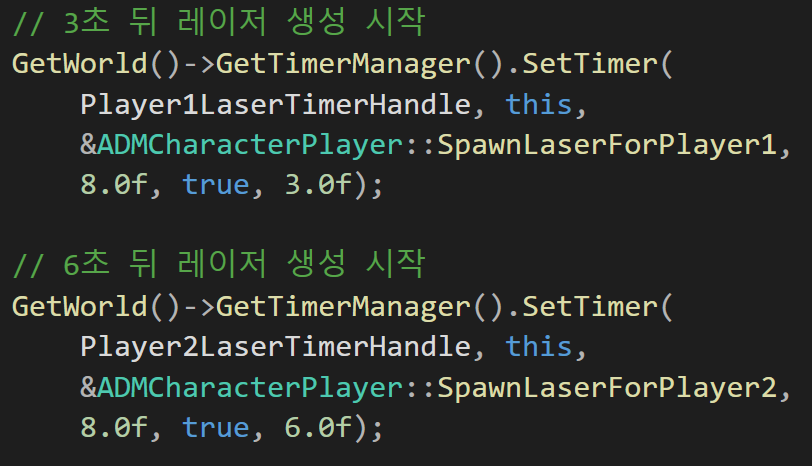 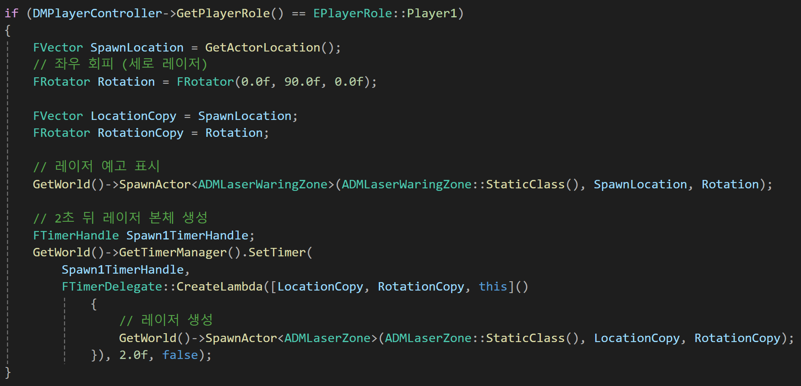 `TimerHandle` 기반 생성 주기 동기화 + 역할별 방향 분기 처리 |
| 적 AI 캐릭터 정찰 도중 정지                   | 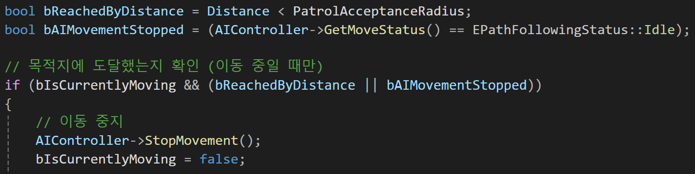 정찰 로직 조건문에 AI 캐릭터 상태 확인 구문 추가 |
| 폭발 효과 미전파                              | 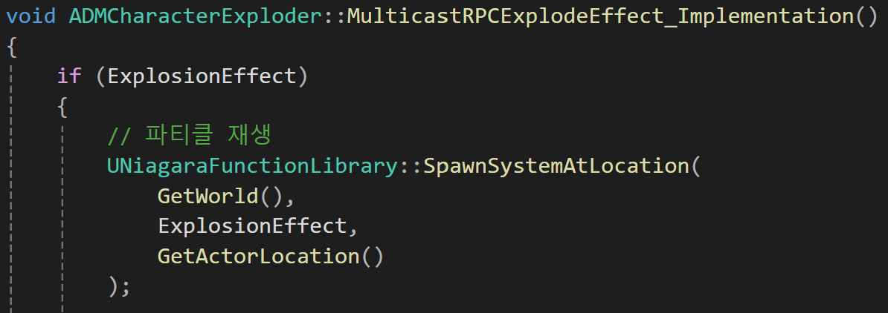 `MulticastRPCExplodeEffect()`로 모든 클라이언트에 Niagara 이펙트 실행 |

---

## 인게임 스크린샷

| Player1 HUD                                 | Player2 HUD                                 |
| ------------------------------------------- | ------------------------------------------- |
| 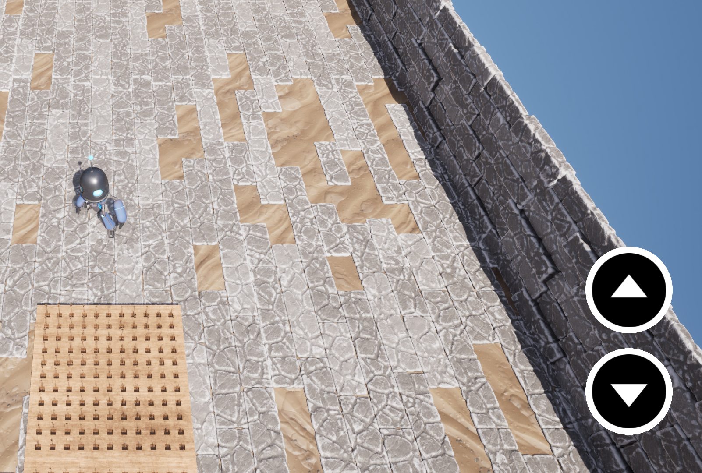   | 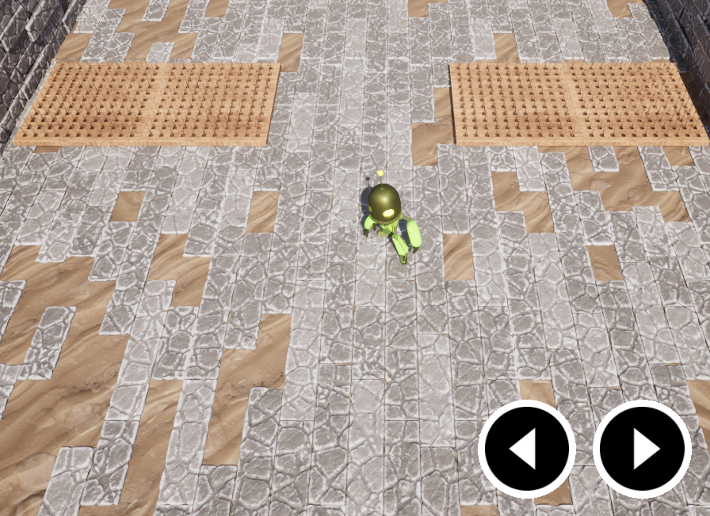   |
| **Player1 Stage**                           | **Player2 Stage**                           |
| 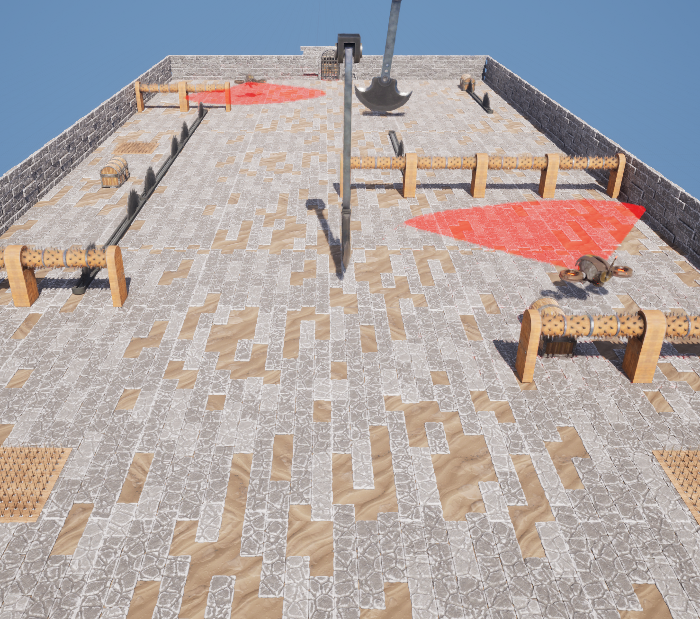 | 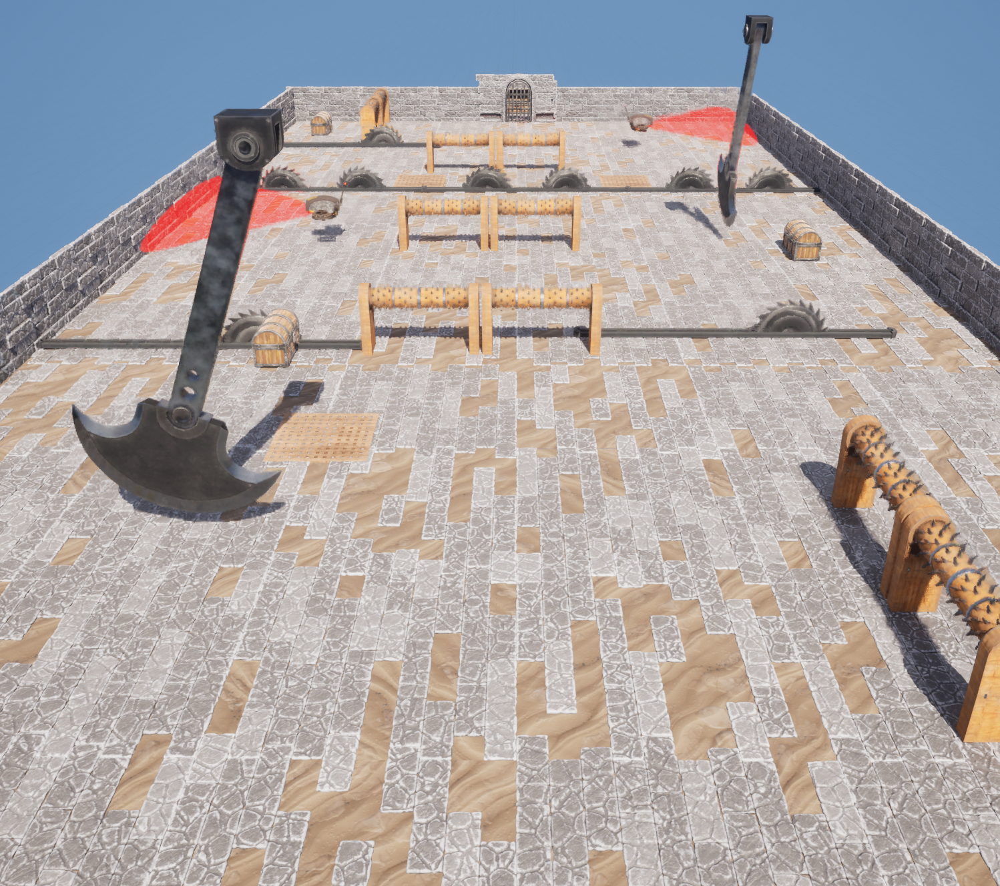 |
| **Player1 Laser**                           | **Player2 Laser**                           |
|  |  |

## 시연 영상

